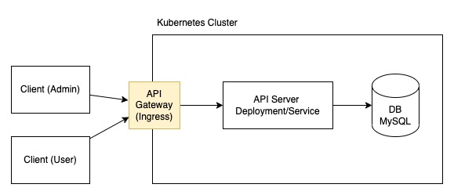

# Golang User Service 



## Api Documentation

head over to https://documenter.getpostman.com/view/24034380/2s8YmULfBm

Credentials:
- username: admin
- password: admin

## Deployment

deployment using kubernetes:

- MySQL (single instance deployment)
- App Service

kubernetes manifest files located in `deploy/` directory
manifest description:

1. Deploy MySQL
```shell
cd deploy

kubectl apply -f mysql/secret.yaml

kubectl apply -f mysql/storage.yaml

# deploy single instance mysql as kubernetes deployment
kubectl apply -f mysql/deployment.yaml
```

2. Deploy App Service (go user service)
```shell
cd deploy

kubectl apply -f secret.yaml

kubectl apply -f deployment.yaml
```

